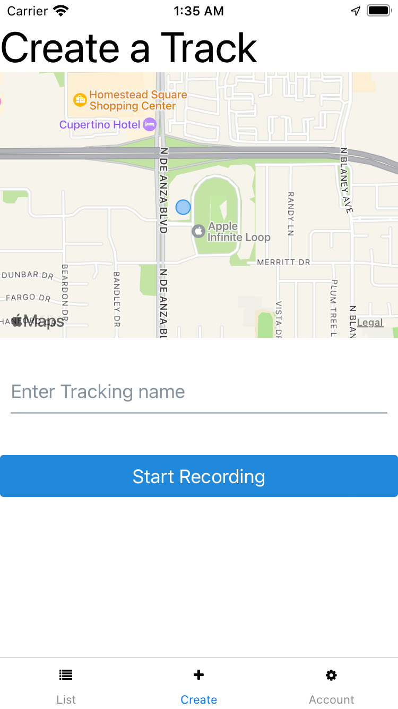

# React-Native repos

## Includes:

- rn-starter
- food
- blog
- tracks (biggest project)

### rn-starter

Learning the basic of react-native:

- Rendering Elements in react-native
- Doing stack navigation

### food

Learning and applying react-native knowledge into real project:

- Apply react-hook (useState/useReducer/useEffect)
- use Yelp as api to fetch restaurants
- Doing stack navigation

### blog

Learning and applying react-native knowledge into real project:

- Apply react-hook (useState/useReducer/useEffect/useContext)
- Using react-native-elements to render beautiful defined elements
- Doing stack navigation
- use AsyncStorage on Phone as localStorage on Web

### tracks (biggest project)

Learning and applying react-native knowledge into real project:

- Apply react-hook (useState/useReducer/useEffect/useContext/useCallback) and define customHook.
- Apply NavigationEvents as detecting onWillFocus/onDidFocus/onWillBlur/onDidBlur. Because react-native screens will not unmounted when switching screen, we have to use NavigationEvents in react-navigation to detect if the current screen is mainly render on screen or not.
- Apply withNavigationFocus to detect if screen is currently renderring on screen or not.
- Create custom axios instance to config baseUrl and use interceptor to config Authorization with token to reduce repeated code when calling request.
- Extract navigation to NavigationRef. That's how we can use navigation outside of React area.
- Define mocking Location to test expo-location.
- Rendering MapView and draw Polyline in MapView.
- Accessing location permission and follow user location if access is granted.
- Doing navigation switch types: Stack Navigation, Switch navigation, Bottom Tab Navigation.
- Rendering icons in Bottom Tab Navigation.
- use navigationOptions to config screen tab.
- Well defined types in typescript.

